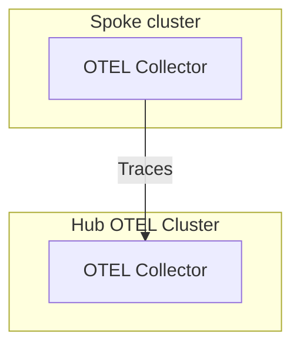

# RHACM OpenTelemetry addon

## Overview
This project is a proof of concept for Red Hat OpenShift Advanced Cluster Administration. It demonstrates the installation and configuration of the OpenTelemetry Collector provided by Red Hat, in a Hub and Spoke cluster setup. This setup involves creating one OpenTelemetry Collector in each spoke cluster that forwards data to a central OpenTelemetry Collector in the hub cluster.

## Features
- **OpenTelemetry Collector Installation**: Automates the deployment of the OpenTelemetry Collector Build by Red Hat in both Hub and Spoke clusters.
- **Cluster Configuration**: Configures each spoke cluster's OpenTelemetry Collector to send data to the central collector in the hub cluster.
- **OpenShift Route Exposure**: Exposes the OpenTelemetry Collector from the Hub Cluster via an OpenShift Route for accessible monitoring and management.
- **Certificate generation**: Generation and configuation of certificates to communicate and authenticate hte OpenTelemetry Collectors.

> [!WARNING]  
> Some of those features are not performed directly by the addon. That can be done in the future if needed but, since this is just a PoC, the current approach is fine.

## Prerequisites
- 1 Red Hat OpenShift Cluster connected with [RHACM](https://www.redhat.com/es/technologies/management/advanced-cluster-management) installed
- 1 Red Hat OpenShift Cluster added as spoke cluster whose name is `cluster1`.

## Installation
1. Clone the repository.
2. Change the `enpoint` field in `cmd/manifests/otel.yaml` to the URL where the collector will be available in your Hub cluster.
3. Run `make demo IMG=<image name>`.
